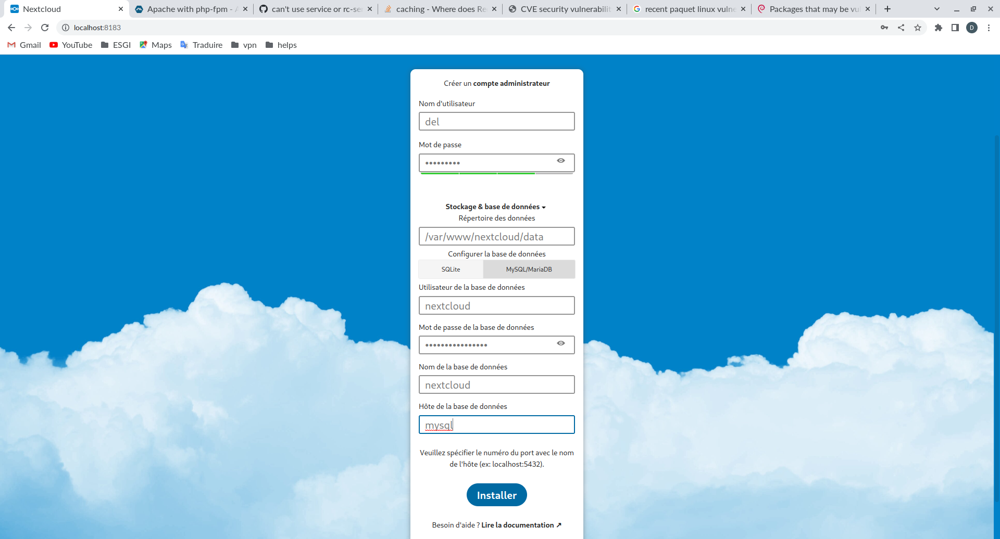

# TP I DOCKER: Création d'une image docker légère pour Nextcloud

## Etape 1: Selection d'une application monoconteneur

L'application ici sera nexcloud avec un redis et une bd mysql.

## Etape 2: Création des dockerfile pour les services

Ici nous allons utiliser une image de base nextcloud buildée par nos soins [voir repository](https://dsdsds).
Et les images mysql et redis seront des images communautaires.

La principale motivation de ne pas builder ces services soi même rélève du fait que ce sont des images avec peu de dépendences. On est loin du nextcloud qui inclus php et apache qui sont deux gros services quand même.

## Etape 3: Création du fichier docker-compose

```yaml

```

## Etape 4: Déploiement de l'application avec docker-compose

* Lancement du docker-compose

```console
delbechir@bngameni:$ docker-compose up
[+] Running 16/16
 ✔ redis 6 layers [⣿⣿⣿⣿⣿⣿]      0B/0B      Pulled                                                                                                      13.0s 
   ✔ 26c5c85e47da Pull complete                                                                                                                         9.6s 
   ✔ 39f79586dcf2 Pull complete                                                                                                                         9.8s 
   ✔ 79c71d0520e5 Pull complete                                                                                                                        10.0s 
   ✔ 60e988668ca1 Pull complete                                                                                                                        11.1s 
   ✔ 873c3fc9fdc6 Pull complete                                                                                                                        11.2s 
   ✔ 50ce7f9bf183 Pull complete                                                                                                                        11.3s 
 ✔ mysql 8 layers [⣿⣿⣿⣿⣿⣿⣿⣿]      0B/0B      Pulled                                                                                                    35.8s 
   ✔ 99803d4b97f3 Pull complete                                                                                                                        10.4s 
   ✔ b8bc823a83fd Pull complete                                                                                                                        10.5s 
   ✔ 16685f710f5d Pull complete                                                                                                                        11.5s 
   ✔ b5660ff63058 Pull complete                                                                                                                        11.7s 
   ✔ 72614a6ad3b0 Pull complete                                                                                                                        11.8s 
   ✔ 139c36c929f4 Pull complete                                                                                                                        33.7s 
   ✔ 2ae942b371c4 Pull complete                                                                                                                        33.9s 
   ✔ 32b352ca7884 Pull complete                                                                                                                        34.1s 
[+] Running 8/8
 ✔ Network docker-compose_redis_net        Created                                                                                                      0.3s 
 ✔ Network docker-compose_nexcloud_net     Created                                                                                                      0.2s 
 ✔ Network docker-compose_mysql_net        Created                                                                                                      0.1s 
 ✔ Volume "docker-compose_nextcloud_data"  Created                                                                                                      0.0s 
 ✔ Volume "docker-compose_db"              Created                                                                                                      0.0s 
 ✔ Container nextcloud_cache               Created                                                                                                      0.2s 
 ✔ Container nexcloud_app                  Created                                                                                                      0.2s 
 ✔ Container nextcloud_database            Created
 Attaching to nexcloud_app, nextcloud_cache, nextcloud_database
nextcloud_cache     | 1:C 26 Apr 2023 06:52:15.572 # oO0OoO0OoO0Oo Redis is starting oO0OoO0OoO0Oo
nextcloud_cache     | 1:C 26 Apr 2023 06:52:15.572 # Redis version=7.0.11, bits=64, commit=00000000, modified=0, pid=1, just started
nextcloud_cache     | 1:C 26 Apr 2023 06:52:15.572 # Warning: no config file specified, using the default config. In order to specify a config file use redis-server /path/to/redis.conf
nextcloud_cache     | 1:M 26 Apr 2023 06:52:15.573 * monotonic clock: POSIX clock_gettime
nextcloud_cache     | 1:M 26 Apr 2023 06:52:15.574 * Running mode=standalone, port=6379.
nextcloud_cache     | 1:M 26 Apr 2023 06:52:15.574 # Server initialized
nextcloud_cache     | 1:M 26 Apr 2023 06:52:15.574 # WARNING Memory overcommit must be enabled! Without it, a background save or replication may fail under low memory condition. Being disabled, it can can also cause failures without low memory condition, see https://github.com/jemalloc/jemalloc/issues/1328. To fix this issue add 'vm.overcommit_memory = 1' to /etc/sysctl.conf and then reboot or run the command 'sysctl vm.overcommit_memory=1' for this to take effect.
nextcloud_cache     | 1:M 26 Apr 2023 06:52:15.575 * Ready to accept connections
nextcloud_database  | 2023-04-26 06:52:15+00:00 [Note] [Entrypoint]: Entrypoint script for MariaDB Server 1:10.6.12+maria~ubu2004 started.
nextcloud_database  | 2023-04-26 06:52:16+00:00 [Note] [Entrypoint]: Switching to dedicated user 'mysql'
nextcloud_database  | 2023-04-26 06:52:16+00:00 [Note] [Entrypoint]: Entrypoint script for MariaDB Server 1:10.6.12+maria~ubu2004 started.
nexcloud_app        | AH00558: httpd: Could not reliably determine the server's fully qualified domain name, using 192.168.0.3. Set the 'ServerName' directive globally to suppress this message
nextcloud_database  | 2023-04-26 06:52:16+00:00 [Note] [Entrypoint]: MariaDB upgrade not required
nexcloud_app        | [26-Apr-2023 06:52:16] NOTICE: fpm is running, pid 1
nexcloud_app        | [26-Apr-2023 06:52:16] NOTICE: ready to handle connections
nextcloud_database  | 2023-04-26  6:52:16 0 [Note] Starting MariaDB 10.6.12-MariaDB-1:10.6.12+maria~ubu2004 source revision 4c79e15cc3716f69c044d4287ad2160da8101cdc as process 1
nextcloud_database  | 2023-04-26  6:52:16 0 [Note] InnoDB: Compressed tables use zlib 1.2.11
nextcloud_database  | 2023-04-26  6:52:16 0 [Note] InnoDB: Number of pools: 1
nextcloud_database  | 2023-04-26  6:52:16 0 [Note] InnoDB: Using crc32 + pclmulqdq instructions
nextcloud_database  | 2023-04-26  6:52:16 0 [Note] mariadbd: O_TMPFILE is not supported on /tmp (disabling future attempts)
nextcloud_database  | 2023-04-26  6:52:16 0 [Note] InnoDB: Using Linux native AIO
nextcloud_database  | 2023-04-26  6:52:16 0 [Note] InnoDB: Initializing buffer pool, total size = 134217728, chunk size = 134217728
nextcloud_database  | 2023-04-26  6:52:16 0 [Note] InnoDB: Completed initialization of buffer pool
nextcloud_database  | 2023-04-26  6:52:16 0 [Note] InnoDB: 128 rollback segments are active.
nextcloud_database  | 2023-04-26  6:52:16 0 [Note] InnoDB: Creating shared tablespace for temporary tables
nextcloud_database  | 2023-04-26  6:52:16 0 [Note] InnoDB: Setting file './ibtmp1' size to 12 MB. Physically writing the file full; Please wait ...
nextcloud_database  | 2023-04-26  6:52:16 0 [Note] InnoDB: File './ibtmp1' size is now 12 MB.
nextcloud_database  | 2023-04-26  6:52:16 0 [Note] InnoDB: 10.6.12 started; log sequence number 42300; transaction id 14
nextcloud_database  | 2023-04-26  6:52:16 0 [Note] Plugin 'FEEDBACK' is disabled.
nextcloud_database  | 2023-04-26  6:52:16 0 [Note] InnoDB: Loading buffer pool(s) from /var/lib/mysql/ib_buffer_pool
nextcloud_database  | 2023-04-26  6:52:16 0 [Note] InnoDB: Buffer pool(s) load completed at 230426  6:52:16
nextcloud_database  | 2023-04-26  6:52:16 0 [Warning] You need to use --log-bin to make --expire-logs-days or --binlog-expire-logs-seconds work.
nextcloud_database  | 2023-04-26  6:52:16 0 [Note] Server socket created on IP: '0.0.0.0'.
nextcloud_database  | 2023-04-26  6:52:16 0 [Note] Server socket created on IP: '::'.
nextcloud_database  | 2023-04-26  6:52:16 0 [Note] mariadbd: ready for connections.
nextcloud_database  | Version: '10.6.12-MariaDB-1:10.6.12+maria~ubu2004'  socket: '/run/mysqld/mysqld.sock'  port: 3306  mariadb.org binary distribution
nexcloud_app        | 127.0.0.1 -  26/Apr/2023:06:52:37 +0000 "GET /index.php" 200                                                                                                      0.2s 
```

* Verifiez que le service fonctionne

```console
delbechir@bngameni:$  docker-compose ps
NAME                 IMAGE               COMMAND                  SERVICE             CREATED             STATUS              PORTS
nextcloud_app        nextcloud:v2       "docker-php-entrypoi…"   nextcloud           13 minutes ago      Up 13 minutes       9000/tcp, 0.0.0.0:8183->80/tcp, :::8183->80/tcp
nextcloud_cache      redis               "docker-entrypoint.s…"   redis               13 minutes ago      Up 13 minutes       6379/tcp
nextcloud_database   mariadb:10.6        "docker-entrypoint.s…"   mysql               13 minutes ago      Up 13 minutes       3306/tcp
```





* Verification des logs du service

```console
delbechir@bngameni:$  docker-compose logs
nextcloud_database  | 2023-04-26 09:16:08+00:00 [Note] [Entrypoint]: Entrypoint script for MariaDB Server 1:10.6.12+maria~ubu2004 started.
nextcloud_database  | 2023-04-26 09:16:08+00:00 [Note] [Entrypoint]: Switching to dedicated user 'mysql'
nextcloud_database  | 2023-04-26 09:16:08+00:00 [Note] [Entrypoint]: Entrypoint script for MariaDB Server 1:10.6.12+maria~ubu2004 started.
nextcloud_database  | 2023-04-26 09:16:08+00:00 [Note] [Entrypoint]: MariaDB upgrade not required
nextcloud_database  | 2023-04-26  9:16:08 0 [Note] Starting MariaDB 10.6.12-MariaDB-1:10.6.12+maria~ubu2004 source revision 4c79e15cc3716f69c044d4287ad2160da8101cdc as process 1
nextcloud_database  | 2023-04-26  9:16:08 0 [Note] InnoDB: Compressed tables use zlib 1.2.11
nextcloud_database  | 2023-04-26  9:16:08 0 [Note] InnoDB: Number of pools: 1
nextcloud_database  | 2023-04-26  9:16:08 0 [Note] InnoDB: Using crc32 + pclmulqdq instructions
nextcloud_database  | 2023-04-26  9:16:08 0 [Note] mariadbd: O_TMPFILE is not supported on /tmp (disabling future attempts)
nextcloud_database  | 2023-04-26  9:16:08 0 [Note] InnoDB: Using Linux native AIO
nextcloud_database  | 2023-04-26  9:16:08 0 [Note] InnoDB: Initializing buffer pool, total size = 134217728, chunk size = 134217728
nextcloud_database  | 2023-04-26  9:16:08 0 [Note] InnoDB: Completed initialization of buffer pool
nextcloud_database  | 2023-04-26  9:16:08 0 [Note] InnoDB: 128 rollback segments are active.
nextcloud_database  | 2023-04-26  9:16:08 0 [Note] InnoDB: Creating shared tablespace for temporary tables
nextcloud_database  | 2023-04-26  9:16:08 0 [Note] InnoDB: Setting file './ibtmp1' size to 12 MB. Physically writing the file full; Please wait ...
nextcloud_database  | 2023-04-26  9:16:08 0 [Note] InnoDB: File './ibtmp1' size is now 12 MB.
nextcloud_database  | 2023-04-26  9:16:08 0 [Note] InnoDB: 10.6.12 started; log sequence number 42312; transaction id 14
nextcloud_database  | 2023-04-26  9:16:08 0 [Note] Plugin 'FEEDBACK' is disabled.
nextcloud_database  | 2023-04-26  9:16:08 0 [Note] InnoDB: Loading buffer pool(s) from /var/lib/mysql/ib_buffer_pool
nextcloud_database  | 2023-04-26  9:16:08 0 [Note] InnoDB: Buffer pool(s) load completed at 230426  9:16:08
nextcloud_database  | 2023-04-26  9:16:08 0 [Warning] You need to use --log-bin to make --expire-logs-days or --binlog-expire-logs-seconds work.
nextcloud_database  | 2023-04-26  9:16:08 0 [Note] Server socket created on IP: '0.0.0.0'.
nextcloud_database  | 2023-04-26  9:16:08 0 [Note] Server socket created on IP: '::'.
nextcloud_database  | 2023-04-26  9:16:08 0 [Note] mariadbd: ready for connections.
nextcloud_database  | Version: '10.6.12-MariaDB-1:10.6.12+maria~ubu2004'  socket: '/run/mysqld/mysqld.sock'  port: 3306  mariadb.org binary distribution
nextcloud_cache     | 1:C 26 Apr 2023 09:16:08.272 # oO0OoO0OoO0Oo Redis is starting oO0OoO0OoO0Oo
nextcloud_cache     | 1:C 26 Apr 2023 09:16:08.272 # Redis version=7.0.11, bits=64, commit=00000000, modified=0, pid=1, just started
nextcloud_cache     | 1:C 26 Apr 2023 09:16:08.272 # Warning: no config file specified, using the default config. In order to specify a config file use redis-server /path/to/redis.conf
nextcloud_cache     | 1:M 26 Apr 2023 09:16:08.272 * monotonic clock: POSIX clock_gettime
nextcloud_cache     | 1:M 26 Apr 2023 09:16:08.273 * Running mode=standalone, port=6379.
nextcloud_cache     | 1:M 26 Apr 2023 09:16:08.273 # Server initialized
nextcloud_cache     | 1:M 26 Apr 2023 09:16:08.273 # WARNING Memory overcommit must be enabled! Without it, a background save or replication may fail under low memory condition. Being disabled, it can can also cause failures without low memory condition, see https://github.com/jemalloc/jemalloc/issues/1328. To fix this issue add 'vm.overcommit_memory = 1' to /etc/sysctl.conf and then reboot or run the command 'sysctl vm.overcommit_memory=1' for this to take effect.
nextcloud_cache     | 1:M 26 Apr 2023 09:16:08.274 * Ready to accept connections
nextcloud_app       | AH00558: httpd: Could not reliably determine the server's fully qualified domain name, using 172.29.0.2. Set the 'ServerName' directive globally to suppress this message
nextcloud_app       | [26-Apr-2023 09:16:08] NOTICE: [pool www] 'user' directive is ignored when FPM is not running as root
nextcloud_app       | [26-Apr-2023 09:16:08] NOTICE: [pool www] 'user' directive is ignored when FPM is not running as root
nextcloud_app       | [26-Apr-2023 09:16:08] NOTICE: [pool www] 'group' directive is ignored when FPM is not running as root
nextcloud_app       | [26-Apr-2023 09:16:08] NOTICE: [pool www] 'group' directive is ignored when FPM is not running as root
nextcloud_app       | [26-Apr-2023 09:16:08] NOTICE: fpm is running, pid 1
nextcloud_app       | [26-Apr-2023 09:16:08] NOTICE: ready to handle connections
nextcloud_app       | 127.0.0.1 -  26/Apr/2023:09:17:49 +0000 "GET /index.php" 200
nextcloud_app       | 127.0.0.1 -  26/Apr/2023:09:18:41 +0000 "POST /index.php" 302
nextcloud_app       | 127.0.0.1 -  26/Apr/2023:09:19:08 +0000 "GET /index.php" 200
nextcloud_app       | 127.0.0.1 -  26/Apr/2023:09:19:09 +0000 "GET /index.php" 200
nextcloud_app       | 127.0.0.1 -  26/Apr/2023:09:19:09 +0000 "GET /index.php" 200
nextcloud_app       | 127.0.0.1 -  26/Apr/2023:09:19:09 +0000 "GET /index.php" 200
nextcloud_app       | 127.0.0.1 -  26/Apr/2023:09:19:09 +0000 "GET /index.php" 200
nextcloud_app       | 127.0.0.1 -  26/Apr/2023:09:19:09 +0000 "GET /index.php" 200
nextcloud_app       | 127.0.0.1 -  26/Apr/2023:09:19:09 +0000 "GET /index.php" 200
nextcloud_app       | 127.0.0.1 -  26/Apr/2023:09:19:09 +0000 "GET /index.php" 200
nextcloud_app       | 127.0.0.1 -  26/Apr/2023:09:19:09 +0000 "GET /index.php" 200
nextcloud_app       | 127.0.0.1 -  26/Apr/2023:09:19:09 +0000 "GET /index.php" 200
nextcloud_app       | 127.0.0.1 -  26/Apr/2023:09:19:09 +0000 "GET /index.php" 200
nextcloud_app       | 127.0.0.1 -  26/Apr/2023:09:19:09 +0000 "GET /index.php" 200
nextcloud_app       | 127.0.0.1 -  26/Apr/2023:09:19:09 +0000 "GET /cron.php" 200
nextcloud_app       | 127.0.0.1 -  26/Apr/2023:09:19:09 +0000 "GET /index.php" 200
nextcloud_app       | 127.0.0.1 -  26/Apr/2023:09:24:57 +0000 "POST /index.php" 200
nextcloud_app       | NOTICE: PHP message: PHP Fatal error:  Allowed memory size of 134217728 bytes exhausted (tried to allocate 262578824 bytes) in /var/www/nextcloud/lib/private/Installer.php on line 299
nextcloud_app       | 127.0.0.1 -  26/Apr/2023:09:25:02 +0000 "POST /index.php" 500
nextcloud_app       | 127.0.0.1 -  26/Apr/2023:09:25:18 +0000 "POST /index.php" 200
nextcloud_app       | 127.0.0.1 -  26/Apr/2023:09:25:20 +0000 "POST /index.php" 200
nextcloud_app       | 127.0.0.1 -  26/Apr/2023:09:25:28 +0000 "POST /index.php" 200
nextcloud_app       | 127.0.0.1 -  26/Apr/2023:09:25:33 +0000 "POST /index.php" 200
nextcloud_app       | 127.0.0.1 -  26/Apr/2023:09:25:36 +0000 "POST /index.php" 200
nextcloud_app       | 127.0.0.1 -  26/Apr/2023:09:25:44 +0000 "GET /index.php" 200
nextcloud_app       | 127.0.0.1 -  26/Apr/2023:09:25:45 +0000 "GET /index.php" 200
nextcloud_app       | 127.0.0.1 -  26/Apr/2023:09:25:46 +0000 "GET /ocs/v2.php" 200
nextcloud_app       | 127.0.0.1 -  26/Apr/2023:09:25:48 +0000 "GET /index.php" 200
nextcloud_app       | 127.0.0.1 -  26/Apr/2023:09:25:48 +0000 "GET /ocs/v2.php" 200
nextcloud_app       | 127.0.0.1 -  26/Apr/2023:09:25:49 +0000 "PUT /ocs/v2.php" 200
nextcloud_app       | 127.0.0.1 -  26/Apr/2023:09:25:48 +0000 "GET /ocs/v2.php" 200
nextcloud_app       | 127.0.0.1 -  26/Apr/2023:09:25:49 +0000 "GET /ocs/v2.php" 200
nextcloud_app       | 127.0.0.1 -  26/Apr/2023:09:25:49 +0000 "PUT /ocs/v2.php" 200
nextcloud_app       | 127.0.0.1 -  26/Apr/2023:09:25:49 +0000 "GET /cron.php" 200
nextcloud_app       | 127.0.0.1 -  26/Apr/2023:09:25:49 +0000 "GET /index.php" 200
nextcloud_app       | 127.0.0.1 -  26/Apr/2023:09:25:49 +0000 "GET /index.php" 200
nextcloud_app       | 127.0.0.1 -  26/Apr/2023:09:25:49 +0000 "GET /ocs/v2.php" 200
nextcloud_app       | 127.0.0.1 -  26/Apr/2023:09:25:49 +0000 "GET /index.php" 200
nextcloud_app       | 127.0.0.1 -  26/Apr/2023:09:25:50 +0000 "GET /index.php" 200
nextcloud_app       | 127.0.0.1 -  26/Apr/2023:09:25:50 +0000 "GET /index.php" 200
nextcloud_app       | 127.0.0.1 -  26/Apr/2023:09:25:50 +0000 "GET /index.php" 200
nextcloud_app       | 127.0.0.1 -  26/Apr/2023:09:25:50 +0000 "GET /index.php" 200
nextcloud_app       | 127.0.0.1 -  26/Apr/2023:09:25:50 +0000 "GET /ocs/v2.php" 200
nextcloud_app       | 127.0.0.1 -  26/Apr/2023:09:25:49 +0000 "GET /index.php" 200
nextcloud_app       | 127.0.0.1 -  26/Apr/2023:09:25:50 +0000 "GET /index.php" 200
nextcloud_app       | 127.0.0.1 -  26/Apr/2023:09:25:49 +0000 "GET /index.php" 200
nextcloud_app       | 127.0.0.1 -  26/Apr/2023:09:25:51 +0000 "PROPFIND /remote.php" 207
nextcloud_app       | 127.0.0.1 -  26/Apr/2023:09:25:51 +0000 "PROPFIND /remote.php" 207
nextcloud_app       | 127.0.0.1 -  26/Apr/2023:09:25:51 +0000 "PROPFIND /remote.php" 207
nextcloud_app       | 127.0.0.1 -  26/Apr/2023:09:25:51 +0000 "REPORT /remote.php" 207
nextcloud_app       | 127.0.0.1 -  26/Apr/2023:09:25:51 +0000 "REPORT /remote.php" 207
nextcloud_app       | 127.0.0.1 -  26/Apr/2023:09:26:18 +0000 "GET /ocs/v2.php" 200
nextcloud_app       | 127.0.0.1 -  26/Apr/2023:09:26:19 +0000 "GET /ocs/v2.php" 304
nextcloud_app       | 127.0.0.1 -  26/Apr/2023:09:26:48 +0000 "GET /ocs/v2.php" 200
nextcloud_app       | 127.0.0.1 -  26/Apr/2023:09:26:49 +0000 "GET /ocs/v2.php" 304
nextcloud_app       | 127.0.0.1 -  26/Apr/2023:09:27:18 +0000 "GET /ocs/v2.php" 200
nextcloud_app       | 127.0.0.1 -  26/Apr/2023:09:27:19 +0000 "GET /ocs/v2.php" 304
nextcloud_app       | 127.0.0.1 -  26/Apr/2023:09:27:48 +0000 "GET /ocs/v2.php" 200
nextcloud_app       | 127.0.0.1 -  26/Apr/2023:09:27:49 +0000 "GET /ocs/v2.php" 304
nextcloud_app       | 127.0.0.1 -  26/Apr/2023:09:28:18 +0000 "GET /ocs/v2.php" 200
nextcloud_app       | 127.0.0.1 -  26/Apr/2023:09:28:19 +0000 "GET /ocs/v2.php" 304
nextcloud_app       | 127.0.0.1 -  26/Apr/2023:09:28:48 +0000 "GET /ocs/v2.php" 200
nextcloud_app       | 127.0.0.1 -  26/Apr/2023:09:28:49 +0000 "GET /ocs/v2.php" 304
nextcloud_app       | 127.0.0.1 -  26/Apr/2023:09:29:18 +0000 "GET /ocs/v2.php" 200
nextcloud_app       | 127.0.0.1 -  26/Apr/2023:09:29:19 +0000 "GET /ocs/v2.php" 304
nextcloud_app       | 127.0.0.1 -  26/Apr/2023:09:29:48 +0000 "GET /ocs/v2.php" 200
nextcloud_app       | 127.0.0.1 -  26/Apr/2023:09:29:49 +0000 "GET /ocs/v2.php" 304
nextcloud_app       | 127.0.0.1 -  26/Apr/2023:09:30:18 +0000 "GET /ocs/v2.php" 200
nextcloud_app       | 127.0.0.1 -  26/Apr/2023:09:30:19 +0000 "GET /ocs/v2.php" 304
nextcloud_app       | 127.0.0.1 -  26/Apr/2023:09:30:48 +0000 "GET /ocs/v2.php" 200
nextcloud_app       | 127.0.0.1 -  26/Apr/2023:09:30:49 +0000 "PUT /ocs/v2.php" 200
nextcloud_app       | 127.0.0.1 -  26/Apr/2023:09:30:49 +0000 "PUT /ocs/v2.php" 200
nextcloud_app       | 127.0.0.1 -  26/Apr/2023:09:30:49 +0000 "GET /ocs/v2.php" 304
nextcloud_app       | 127.0.0.1 -  26/Apr/2023:09:31:18 +0000 "GET /ocs/v2.php" 200
nextcloud_app       | 127.0.0.1 -  26/Apr/2023:09:31:19 +0000 "GET /ocs/v2.php" 304
nextcloud_app       | 127.0.0.1 -  26/Apr/2023:09:31:48 +0000 "GET /ocs/v2.php" 200
nextcloud_app       | 127.0.0.1 -  26/Apr/2023:09:31:49 +0000 "GET /ocs/v2.php" 304
nextcloud_app       | 127.0.0.1 -  26/Apr/2023:09:32:18 +0000 "GET /ocs/v2.php" 200
nextcloud_app       | 127.0.0.1 -  26/Apr/2023:09:32:19 +0000 "GET /ocs/v2.php" 304
nextcloud_app       | 127.0.0.1 -  26/Apr/2023:09:32:48 +0000 "GET /ocs/v2.php" 200
nextcloud_app       | 127.0.0.1 -  26/Apr/2023:09:32:49 +0000 "GET /ocs/v2.php" 304
nextcloud_app       | 127.0.0.1 -  26/Apr/2023:09:33:18 +0000 "GET /ocs/v2.php" 200
nextcloud_app       | 127.0.0.1 -  26/Apr/2023:09:33:19 +0000 "GET /ocs/v2.php" 304
nextcloud_app       | 127.0.0.1 -  26/Apr/2023:09:33:48 +0000 "GET /ocs/v2.php" 200
nextcloud_app       | 127.0.0.1 -  26/Apr/2023:09:33:49 +0000 "GET /ocs/v2.php" 304
nextcloud_app       | 127.0.0.1 -  26/Apr/2023:09:34:18 +0000 "GET /ocs/v2.php" 200
nextcloud_app       | 127.0.0.1 -  26/Apr/2023:09:34:19 +0000 "GET /ocs/v2.php" 304
nextcloud_app       | 127.0.0.1 -  26/Apr/2023:09:34:48 +0000 "GET /ocs/v2.php" 200
nextcloud_app       | 127.0.0.1 -  26/Apr/2023:09:34:49 +0000 "GET /ocs/v2.php" 304
nextcloud_app       | 127.0.0.1 -  26/Apr/2023:09:35:18 +0000 "GET /ocs/v2.php" 200
nextcloud_app       | 127.0.0.1 -  26/Apr/2023:09:35:19 +0000 "GET /ocs/v2.php" 304
nextcloud_app       | 127.0.0.1 -  26/Apr/2023:09:35:48 +0000 "GET /ocs/v2.php" 200
nextcloud_app       | 127.0.0.1 -  26/Apr/2023:09:35:49 +0000 "PUT /ocs/v2.php" 200
nextcloud_app       | 127.0.0.1 -  26/Apr/2023:09:35:49 +0000 "PUT /ocs/v2.php" 200
nextcloud_app       | 127.0.0.1 -  26/Apr/2023:09:35:49 +0000 "GET /ocs/v2.php" 304
nextcloud_app       | 127.0.0.1 -  26/Apr/2023:09:36:18 +0000 "GET /ocs/v2.php" 200
nextcloud_app       | 127.0.0.1 -  26/Apr/2023:09:36:19 +0000 "GET /ocs/v2.php" 304
nextcloud_app       | 127.0.0.1 -  26/Apr/2023:09:36:48 +0000 "GET /ocs/v2.php" 200
nextcloud_app       | 127.0.0.1 -  26/Apr/2023:09:36:49 +0000 "GET /ocs/v2.php" 304
nextcloud_app       | 127.0.0.1 -  26/Apr/2023:09:37:18 +0000 "GET /ocs/v2.php" 200
nextcloud_app       | 127.0.0.1 -  26/Apr/2023:09:37:19 +0000 "GET /ocs/v2.php" 304
nextcloud_app       | 127.0.0.1 -  26/Apr/2023:09:37:48 +0000 "GET /ocs/v2.php" 200
nextcloud_app       | 127.0.0.1 -  26/Apr/2023:09:37:49 +0000 "GET /index.php" 200
nextcloud_app       | 127.0.0.1 -  26/Apr/2023:09:37:49 +0000 "GET /ocs/v2.php" 304
nextcloud_app       | 127.0.0.1 -  26/Apr/2023:09:38:18 +0000 "GET /ocs/v2.php" 200
nextcloud_app       | 127.0.0.1 -  26/Apr/2023:09:38:19 +0000 "GET /ocs/v2.php" 304
nextcloud_app       | 127.0.0.1 -  26/Apr/2023:09:38:48 +0000 "GET /ocs/v2.php" 200
nextcloud_app       | 127.0.0.1 -  26/Apr/2023:09:38:49 +0000 "GET /ocs/v2.php" 304
nextcloud_app       | 127.0.0.1 -  26/Apr/2023:09:39:18 +0000 "GET /ocs/v2.php" 200
nextcloud_app       | 127.0.0.1 -  26/Apr/2023:09:39:19 +0000 "GET /ocs/v2.php" 304
nextcloud_app       | 127.0.0.1 -  26/Apr/2023:09:39:48 +0000 "GET /ocs/v2.php" 200
nextcloud_app       | 127.0.0.1 -  26/Apr/2023:09:39:49 +0000 "GET /ocs/v2.php" 304
nextcloud_app       | 127.0.0.1 -  26/Apr/2023:09:40:18 +0000 "GET /ocs/v2.php" 200
nextcloud_app       | 127.0.0.1 -  26/Apr/2023:09:40:19 +0000 "GET /ocs/v2.php" 304
nextcloud_app       | 127.0.0.1 -  26/Apr/2023:09:40:48 +0000 "GET /ocs/v2.php" 200
nextcloud_app       | 127.0.0.1 -  26/Apr/2023:09:40:49 +0000 "PUT /ocs/v2.php" 200
nextcloud_app       | 127.0.0.1 -  26/Apr/2023:09:40:49 +0000 "PUT /ocs/v2.php" 200
nextcloud_app       | 127.0.0.1 -  26/Apr/2023:09:40:49 +0000 "GET /ocs/v2.php" 304
nextcloud_app       | 127.0.0.1 -  26/Apr/2023:09:41:18 +0000 "GET /ocs/v2.php" 200
nextcloud_app       | 127.0.0.1 -  26/Apr/2023:09:41:19 +0000 "GET /ocs/v2.php" 304
nextcloud_app       | 127.0.0.1 -  26/Apr/2023:09:41:48 +0000 "GET /ocs/v2.php" 200
nextcloud_app       | 127.0.0.1 -  26/Apr/2023:09:41:49 +0000 "GET /ocs/v2.php" 304
nextcloud_app       | 127.0.0.1 -  26/Apr/2023:09:42:18 +0000 "GET /ocs/v2.php" 200
nextcloud_app       | 127.0.0.1 -  26/Apr/2023:09:42:19 +0000 "GET /ocs/v2.php" 304
nextcloud_app       | 127.0.0.1 -  26/Apr/2023:09:42:28 +0000 "DELETE /index.php" 200
nextcloud_app       | 127.0.0.1 -  26/Apr/2023:09:42:48 +0000 "GET /ocs/v2.php" 200
nextcloud_app       | 127.0.0.1 -  26/Apr/2023:09:42:49 +0000 "GET /ocs/v2.php" 304
nextcloud_app       | 127.0.0.1 -  26/Apr/2023:09:43:18 +0000 "GET /ocs/v2.php" 200
nextcloud_app       | 127.0.0.1 -  26/Apr/2023:09:43:20 +0000 "GET /ocs/v2.php" 304
nextcloud_app       | 127.0.0.1 -  26/Apr/2023:09:43:48 +0000 "GET /ocs/v2.php" 200
nextcloud_app       | 127.0.0.1 -  26/Apr/2023:09:43:49 +0000 "GET /ocs/v2.php" 304
nextcloud_app       | 127.0.0.1 -  26/Apr/2023:09:44:18 +0000 "GET /ocs/v2.php" 200
nextcloud_app       | 127.0.0.1 -  26/Apr/2023:09:44:19 +0000 "GET /ocs/v2.php" 304
nextcloud_app       | 127.0.0.1 -  26/Apr/2023:09:44:48 +0000 "GET /ocs/v2.php" 200
nextcloud_app       | 127.0.0.1 -  26/Apr/2023:09:44:49 +0000 "GET /ocs/v2.php" 304
nextcloud_app       | 127.0.0.1 -  26/Apr/2023:09:45:18 +0000 "GET /ocs/v2.php" 200
nextcloud_app       | 127.0.0.1 -  26/Apr/2023:09:45:19 +0000 "GET /ocs/v2.php" 304
```

## Etape 5: Documentation et Conclusions

* 